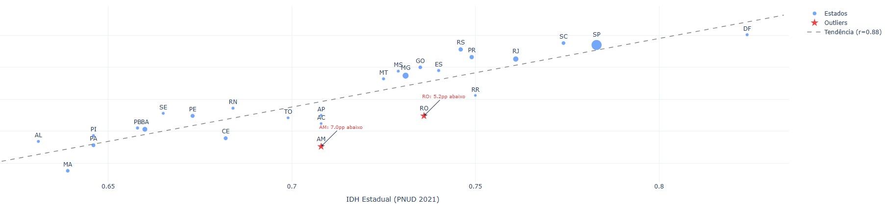

# Market Expansion EDA — Acesso à Internet no Brasil (IBGE)

<div align="center">


**Análise geoespacial de oportunidades de expansão para ISPs usando dados públicos do IBGE.**  
PNAD Contínua + choroplethas interativos por estado. Onde estão os domicílios ainda sem internet?

</div>

---



*IDH estadual contra percentual de domicílios com internet (r = 0,88). Bolha proporcional à
população; estrelas marcam os estados que ficam mais abaixo da linha de tendência do que o
IDH deles explicaria — Amazonas 7,0pp e Rondônia 5,2pp.*

---

## O Problema de Negócio

Para um ISP decidindo onde expandir infraestrutura, a pergunta crítica é: **quais regiões combinam alta densidade populacional com baixa penetração de internet?** Este projeto responde essa pergunta cruzando dados de acesso à internet (PNAD Contínua) com indicadores demográficos e socioeconômicos do IBGE, entregando um mapa de oportunidades de mercado.

---

## Fonte de Dados

**IBGE — PNAD Contínua: Acesso à Internet e à Televisão**

- API SIDRA (Sistema IBGE de Recuperação Automática): `api.sidra.ibge.gov.br`
- Tabela principal: 9173 (Domicílios com acesso à internet por UF)
- Cobertura: 2019–2023, por Unidade da Federação
- Breakdown: urbano/rural, tipo de dispositivo, tipo de conexão
- Complemento: Estimativas populacionais por UF (IBGE)
- GeoJSON: Malha estadual do Brasil (IBGE geoftp)
- Licença: Pública — Uso Livre

---

## Estrutura do Projeto

```
market-expansion-eda/
├── README.md
├── requirements.txt
├── notebooks/
│   └── ibge_internet_access.ipynb   ← EDA geoespacial completa
└── data/
    └── README.md                     ← Fontes e instruções de download
```

---

## Principais Achados

### Penetração Nacional (2023)
- **90,0% dos domicílios urbanos** têm acesso à internet
- **67,5% dos domicílios rurais** têm acesso — gap de 22,5pp
- Crescimento de +8pp em 5 anos (2019 → 2023)

### Estados com Maior Oportunidade
| UF | Penetração | Pop. (mi) | Domicílios sem internet |
|----|-----------|-----------|------------------------|
| PA | 71,3% | 8,8 | ~770 mil |
| MA | 69,8% | 7,1 | ~640 mil |
| AM | 72,1% | 4,3 | ~360 mil |
| PI | 70,4% | 3,3 | ~290 mil |
| AL | 73,2% | 3,4 | ~270 mil |

### Gap Digital Urbano × Rural por Região
- Norte: 33pp de gap (maior do país)
- Nordeste: 28pp
- Centro-Oeste: 18pp
- Sudeste: 12pp
- Sul: 10pp

---

## Técnicas Demonstradas

```python
# IBGE SIDRA API — acesso programático
import requests

url = "https://servicodados.ibge.gov.br/api/v3/agregados/9173/periodos/2023/variaveis/49109"
resp = requests.get(url, params={"localidades": "N3[all]"})
data = resp.json()

# Choropleth interativo com Plotly
import plotly.express as px

fig = px.choropleth(
    df_states,
    geojson=geojson_brasil,
    locations="uf_codigo",
    featureidkey="properties.codarea",
    color="pct_internet",
    color_continuous_scale="Blues",
    range_color=(60, 100),
    labels={"pct_internet": "% com internet"},
    title="Penetração de Internet por Estado — Brasil 2023"
)

# Score de oportunidade composto
df["score_oportunidade"] = (
    (1 - df["pct_internet"] / 100) * df["populacao"] / 1_000_000
) * df["indice_renda_normalizado"]
```

---

## Visualizações

- Choropleth interativo por estado (% domicílios com internet)
- Heatmap regional: ano × região (evolução temporal)
- Scatter: penetração × IDH por estado
- Barras horizontais: top 10 estados por "domicílios sem internet"
- Sunburst: distribuição por região → estado → urbano/rural

---

## Como Rodar

```bash
git clone https://github.com/HugoLeonardoNz/market-expansion-eda.git
cd market-expansion-eda
pip install -r requirements.txt

# O notebook baixa dados via IBGE API automaticamente
jupyter notebook notebooks/ibge_internet_access.ipynb
```

**Nota:** A célula de download faz chamadas à API pública do IBGE. Requer conexão com internet. Os dados são cacheados localmente em `data/` após o primeiro download.

---

## Stack

`Python` · `Pandas` · `NumPy` · `Plotly Express` · `Requests` · `Jupyter`

---

## Autor

**Hugo Leonardo**  
Analista de Dados Pleno — SQL · Python · Power BI  
Speed Fibra · Santa Luzia, MG

[](https://www.linkedin.com/in/hugo-leonardo-data-analyst/)
[](https://github.com/HugoLeonardoNz)

---

<div align="center">
<sub>Dados públicos do IBGE — PNAD Contínua. Uso livre conforme política de dados abertos do IBGE.</sub>
</div>
