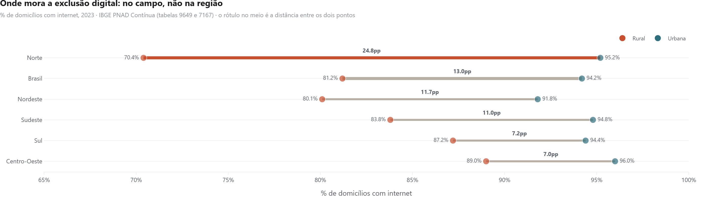
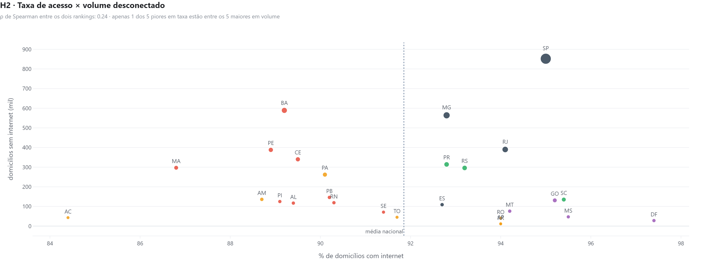
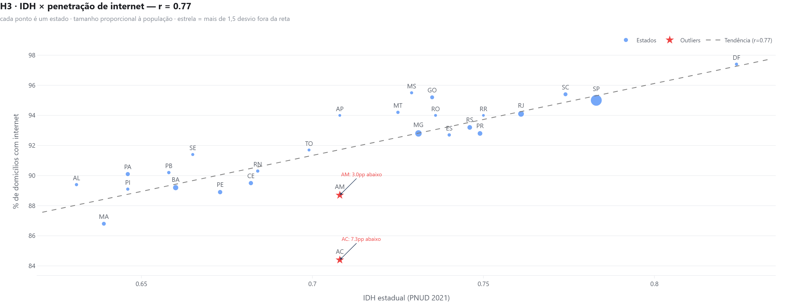

# Expansão de mercado — onde um ISP deve investir primeiro

<div align="center">


**Em 2023, 92,6% dos domicílios brasileiros tinham internet. A divisão que sobrou não é
entre regiões — é entre a cidade e o campo, e ela é maior no Norte, onde as
cidades já têm acesso acima da média nacional.**

</div>



---

## O achado que muda a decisão

**A brecha regional praticamente acabou. A brecha rural, não.**

O gap entre Norte+Nordeste e Sul+Sudeste é de **4,6 pontos percentuais** — pequeno
demais para orientar capex. Já o gap entre domicílio urbano e rural é de **13,0
pontos no país**, e abre muito mais em algumas regiões:

| Região | Urbana | Rural | Gap |
|---|---:|---:|---:|
| **Norte** | **95,2%** | **70,4%** | **24,8pp** |
| Nordeste | 91,8% | 80,1% | 11,7pp |
| Sudeste | 94,8% | 83,8% | 11,0pp |
| Sul | 94,4% | 87,2% | 7,2pp |
| Centro-Oeste | 96,0% | 89,0% | 7,0pp |
| *Brasil* | *94,2%* | *81,2%* | *13,0pp* |

Leia a primeira linha de novo: **o Norte urbano tem 95,2% de acesso — acima da
média nacional de 92,6%.** A cidade do Norte não é mercado de expansão de
cobertura; é mercado disputado. O que existe lá é o pior rural do país, 70,4%,
com um gap três vezes e meia maior que o do Centro-Oeste.

Isso troca a natureza do investimento: no Norte, expandir é obra de infra rural —
não é vender melhor numa praça urbana já atendida.



### E os dois rankings continuam discordando

A correlação de postos entre "pior taxa de acesso" e "maior número de domicílios
sem internet" é de **ρ = 0,24**. Dos cinco estados com pior penetração, **apenas
um** está entre os cinco com maior volume desconectado.

| # | Pior taxa | | Maior volume sem internet |
|---|---|---|---|
| 1 | AC · 84,4% | | SP · 852 mil domicílios (95,0%) |
| 2 | MA · 86,8% | | BA · 589 mil (89,2%) |
| 3 | AM · 88,7% | | MG · 564 mil (92,8%) |
| 4 | PE · 88,9% | | RJ · 390 mil (94,1%) |
| 5 | PI · 89,1% | | PE · 388 mil (88,9%) |

São Paulo tem a **melhor** taxa do país e o **maior** número absoluto de
domicílios desconectados. Quem planeja pelo percentual vai para o Acre; quem
planeja por mercado endereçável vai para São Paulo. São decisões de capex
opostas, tiradas do mesmo dado.

O score de oportunidade combina volume, lacuna e IDH, com pesos declarados no
código. Estados acima de 92% de penetração ficam fora da fila — são mercados de
retenção e upgrade. **A fila abaixo é de 2023**; a seção seguinte explica por que não é
de 2025:

| # | Estado | Região | Penetração | Domicílios sem internet | IDH | Score |
|---|---|---|---:|---:|---:|---:|
| 1 | Bahia | Nordeste | 89,2% | 589 mil | 0,660 | 43,6 |
| 2 | Pernambuco | Nordeste | 88,9% | 388 mil | 0,673 | 30,3 |
| 3 | Ceará | Nordeste | 89,5% | 340 mil | 0,682 | 28,3 |
| 4 | Maranhão | Nordeste | 86,8% | 297 mil | 0,639 | 22,4 |
| 5 | Amazonas | Norte | 88,7% | 136 mil | 0,708 | 14,5 |

### Por que a fila é de 2023, com a série indo até 2025

Porque em 2025 ela não existe mais.

O corte de 92% de penetração deixava **13 estados** na fila em 2023. Em 2025 deixa
**um**: o Acre, com 90,6%. O estado com pior acesso do país em 2025 tem mais acesso do
que a média nacional tinha em 2022.

| | Estados abaixo de 92% | Pior estado | Melhor estado |
|---|---:|---:|---:|
| 2023 | 13 | 84,4% (AC) | 97,4% (DF) |
| **2025** | **1** | **90,6% (AC)** | **98,3% (DF)** |

Isso não é defeito do recorte — é o resultado. **A pergunta "em que estado expandir
por lacuna de acesso" tem prazo de validade, e ele venceu.** Rodar o mesmo score sobre
2025 devolveria uma fila de um item, o que não é análise: é um indicador que parou de
discriminar porque o mercado saturou no grão em que ele enxerga.

O recorte de 2023 fica, então, por dois motivos declarados: é o último ano em que o
exercício separa estados, e é o ano em que o método pode ser conferido contra o release
publicado do IBGE (92,6% calculado aqui contra 92,5% divulgado). O que **substitui** essa
análise em 2025 está no
[painel Power BI](https://github.com/HugoLeonardoNz/socioeconomic-powerbi-public), que
se ancora sempre no último ano: lá a leitura deixou de ser por estado e passou a ser
urbano × rural, onde a distância ainda é de 13,1pp no Norte.

---

## As três hipóteses

Declaradas antes de olhar o resultado; o script imprime confirmada ou refutada.

| # | Hipótese | Resultado |
|---|---|---|
| H1 | Há gap regional relevante entre Norte+Nordeste e Sul+Sudeste | **Refutada** — 4,6pp |
| H2 | O ranking por taxa e o por volume apontam para estados diferentes | **Confirmada** — ρ = 0,24; 1 de 5 coincide |
| H3 | O IDH estadual explica boa parte da variação de acesso | **Confirmada** — r = 0,769 (r² = 0,59) |

**H1 foi refutada, e é a hipótese mais útil das três.** Uma versão anterior deste
projeto a dava como confirmada, com 11,1pp — mas rodava sobre percentuais
escritos à mão que não vinham do PNAD. Com o dado observado, o gap regional cai
para 4,6pp: a desigualdade de acesso migrou de "que região" para "cidade ou
campo". Quem ainda planeja expansão por mapa de região está resolvendo um
problema que encolheu.



Amazonas e Rondônia ficam mais abaixo da reta do que o IDH deles explicaria
— 7,0pp e 5,2pp. Em análise de expansão isso é uma pista: o acesso ali está
abaixo do que a renda da população suportaria, o que costuma indicar falta de
oferta, não falta de demanda.

---

## O recorte urbano × rural voltou — agora observado

Uma versão anterior deste projeto trazia um gap urbano × rural de **25,0 pontos
percentuais**, idêntico nos 27 estados. Ele era construído: as colunas de
penetração urbana e rural saíam de `total + 5` e `total − 20`. Uma constante
comparada com um número observado não pode ser refutada, e a conclusão abria o
sumário executivo. O recorte foi removido inteiro.

Ele volta agora porque o número **existe** e é público — só não estava sendo
buscado. O gap real é de **13,0pp** no Brasil e varia de 7,0pp (Centro-Oeste) a
24,8pp (Norte). Variar é o ponto: é o que separa um indicador de uma decoração.

Uma coisa mudou junto, e ela importa: **o grão.** O IBGE não publica urbano ×
rural por UF — a amostra da PNAD não sustenta esse cruzamento, e a API devolve
`-` para os 27 estados. O recorte real existe em Brasil e Grandes Regiões, e é
nesse grão que ele aparece aqui. O dado fabricado existia em qualquer grão que
se quisesse, porque não vinha de lugar nenhum.

## Da estimativa para a contagem

O número de domicílios sem internet também deixou de ser estimado. Antes era
`população ÷ 3,1 moradores × (1 − penetração)` — uma média nacional de moradores
por domicílio aplicada aos 27 estados. Como o domicílio do Norte e do Nordeste é
maior que a média, a conta subestimava justamente as praças que o projeto
recomenda. Agora o total de domicílios vem da própria PNAD, e o desconectado é
subtração de dois observados.

## Fonte dos dados

Tudo que é percentual ou contagem de domicílio vem da **API do SIDRA**, buscado
em tempo de execução e com o retorno cru versionado em `data/sidra_cache/`.

| Indicador | Tabela SIDRA | Grão | Natureza |
|---|---|---|---|
| Domicílios com internet, 2022–2025 | **9649** | UF · Região · Brasil | Observado |
| Domicílios com internet, 2016–2021 | **7311** | UF · Região · Brasil | Observado |
| Total de domicílios (denominador) | **7167** | UF · Região · Brasil | Observado |
| Urbano × rural | 9649 + 7167 | **Brasil e Região** — não há UF | Observado |
| IDH estadual | PNUD · Atlas | UF | Observado (Censo 2010) |

Não existe tabela que já entregue "% de domicílios com internet por UF": o
percentual é a razão entre duas tabelas da mesma pesquisa, no mesmo grão.
`sidra.py` explica a escolha de cada uma.

**O método foi conferido contra o número publicado pelo IBGE.** O release da
PNAD TIC 2023 diz 92,5% dos domicílios; este pipeline calcula 92,6%, e o corte
urbano/rural sai em 94,2% / 81,2% contra os 94,1% / 81,0% publicados. A diferença
de 0,1–0,2pp é arredondamento — as tabelas publicam em "mil domicílios".

**2020 não existe na série.** A PNAD Contínua não coletou o módulo de TIC naquele
ano por causa da pandemia. O ponto não é interpolado para o gráfico ficar
contínuo.

**Sem API e sem cache, o script para.** `sidra.py` levanta `SidraIndisponivel` em
vez de cair num fallback. A versão anterior tinha um fallback offline, e é
exatamente por isso que ela rodou meses com número inventado sob um rodapé que
dizia "Fonte: IBGE" — a chamada de API que existia apontava para o agregado
**9173**, que é *"Produção, Venda e Valor da produção na agroindústria rural"* do
**Censo Agropecuário de 2017**. Tabela errada, pesquisa errada, ano errado.
Nenhum teste falhava, porque o fallback sempre respondia.

## Como rodar

```bash
pip install -r requirements.txt

python run_analysis.py     # 6 figuras + PNGs do README + teste das 3 hipóteses
python market_scoring.py   # ranking completo e top 5 em CSV
```

O tema dos gráficos fica em [`theme.py`](theme.py) — título, subtítulo,
tipografia, grade e escala de cor definidos uma vez e aplicados por `finish()`.
Os HTMLs saem com `include_plotlyjs="cdn"`: cada figura pesa ~15 KB em vez de
carregar a biblioteca inteira seis vezes dentro do repositório.

---

## Estrutura

```
market-expansion-eda/
├── run_analysis.py                — EDA, 3 hipóteses, 6 figuras
├── market_scoring.py              — score de oportunidade + estratégia por estado
├── theme.py                       — tema único dos gráficos
├── executive_summary.md           — a leitura de negócio, sem código
├── notebooks/
│   └── market_expansion_eda.ipynb — a mesma análise, com narrativa
├── outputs/
│   ├── figures/                   — 6 HTMLs interativos
│   ├── market_scores.csv          — os 27 estados, ranqueados
│   └── top5_recommendation.csv
└── docs/img/                      — PNGs do README, exportados pelo script
```

---

## Autor

**Hugo Leonardo** · Analista de Dados Pleno — SQL · Python · Power BI
Speed Fibra · Santa Luzia, MG

[](https://www.linkedin.com/in/hugo-leonardo-data-analyst/)
[](https://github.com/HugoLeonardoNz)
